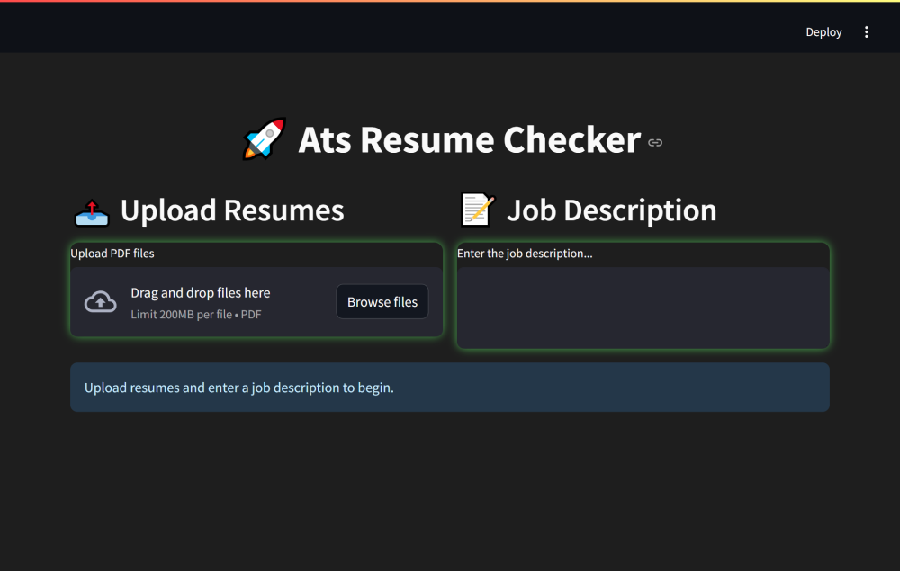
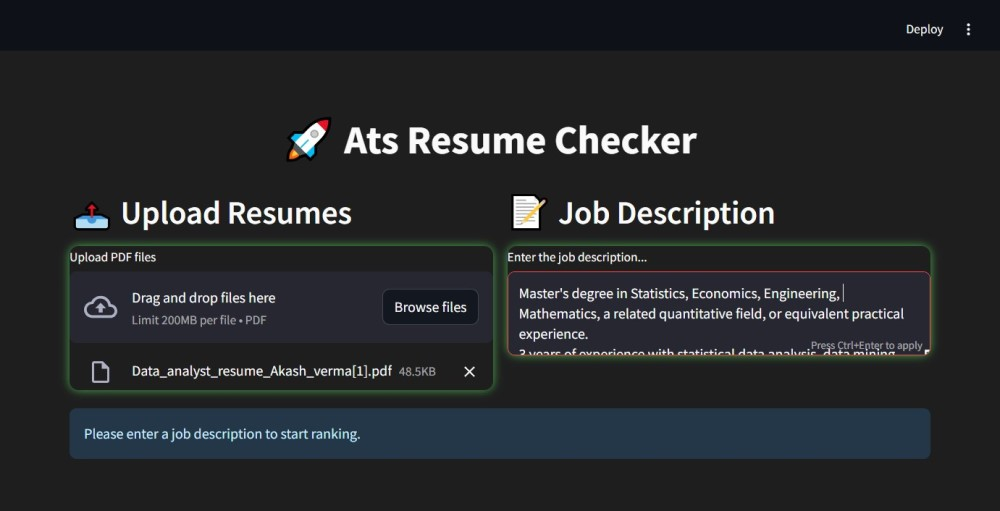
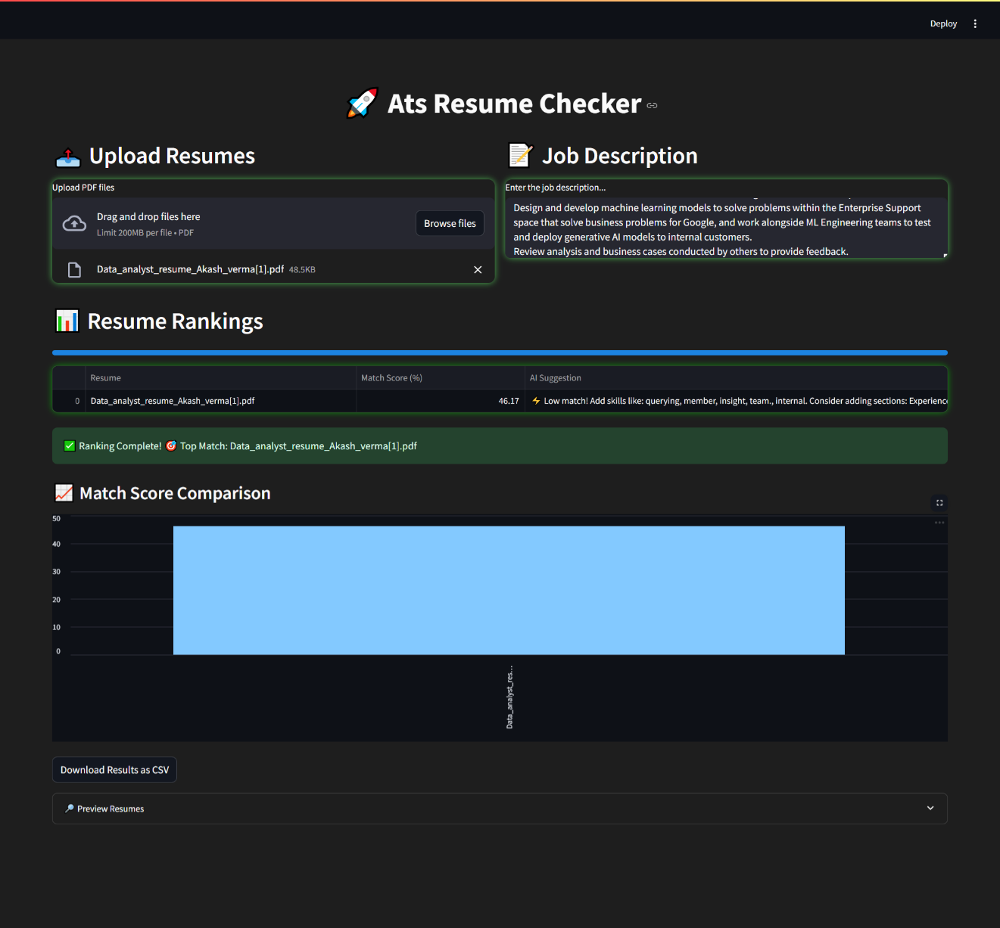

# RESUME ATS CHECKER

RESUME ATS CHECKER is an AI-powered recruitment tool designed to streamline resume evaluations by analyzing and scoring resumes against job descriptions. It provides actionable suggestions for resume improvements, ranks resumes based on ATS scores, and visualizes the data through graphical charts to help recruiters make data-driven hiring decisions.

Features:
- Bulk upload resumes for ATS scoring.
- AI-driven suggestions to enhance resumes.
- Sorting resumes based on ATS scores.
- Graphical representations of ATS score analysis.

Installation and Setup:
1. Clone the repository:
    git clone https://github.com/Vinay642CoderG/ats-resume-checker.git
    cd ats-resume-checker

2. Create a virtual environment:
    python -m venv .env

3. Activate the virtual environment:
   - On Windows:
     .env\Scripts\activate
   - On macOS/Linux:
     source .env/bin/activate

4. Install dependencies:
    pip install -r requirements.txt

5. Run the project:
    cd project
    streamlit run app.py

Usage:

Step 1: System Introduction
--------------------------------

This step provides a concise overview of the ATS RESUME CHECKER system. It introduces the tool's purpose, key features, and its role in optimizing recruitment processes. The introductory section explains how the system evaluates resumes, offers AI-driven suggestions, ranks candidates, and visualizes results for data-driven insights.

Step 2: Uploading Resumes and Job Description
---------------------------------------------

In this step, users upload multiple resumes along with the job description to the system. The ATS RESUME CHECKER processes the inputs and analyzes the compatibility of resumes with the job description. This section highlights the tool's ability to handle bulk uploads and initiate the ATS scoring process seamlessly.

Step 3: Output Analysis and Visualization
-----------------------------------------

This step displays the analysis results, including ATS scores for each resume. AI-powered suggestions for improvement are provided to enhance candidates' resumes. Resumes are ranked based on their scores, and visual representations such as graphs and charts are generated to summarize the insights, making interpretation intuitive and efficient for users.

Limitations:
- Dependence on input quality for accurate scoring and suggestions.
- Compatibility with specific ATS platforms may vary.
- Requires basic understanding of graphical insights for interpretation.

Future Scope:
- Integration with popular ATS platforms.
- Real-time resume feedback and multilingual support.
- Advanced predictive analytics for hiring trends.

Contributing:
Pull requests are welcome. For major changes, please open an issue first to discuss what you'd like to change.

License:
This project is licensed under the MIT License.

